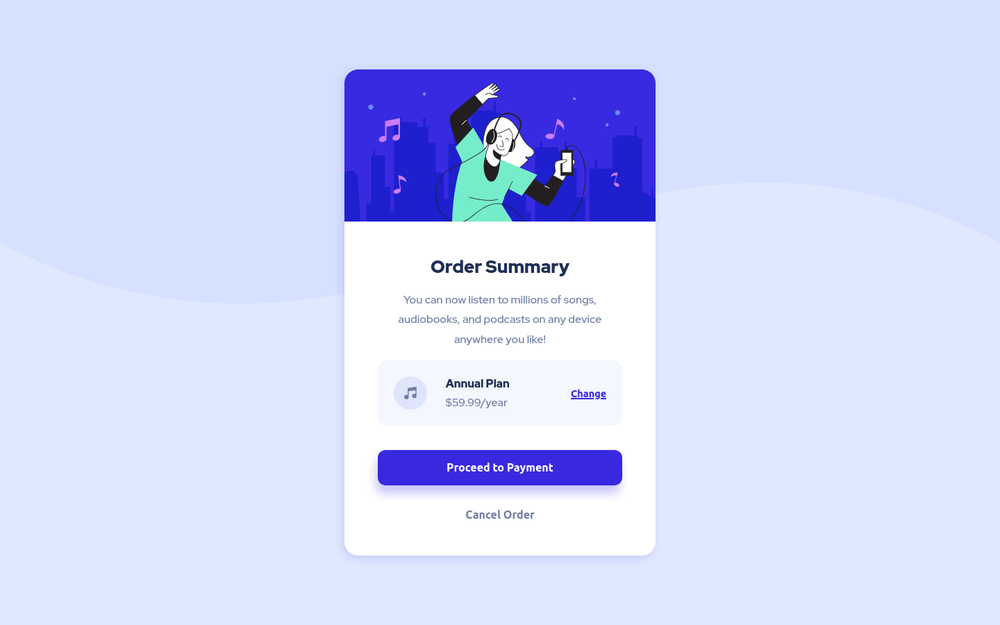

# Frontend Mentor - Order summary card solution

This is a solution to the [Order summary card challenge on Frontend Mentor](https://www.frontendmentor.io/challenges/order-summary-component-QlPmajDUj). Frontend Mentor challenges help you improve your coding skills by building realistic projects.

## Table of contents

- [Overview](#overview)
  - [The challenge](#the-challenge)
  - [Screenshot](#screenshot)
  - [Links](#links)
  - [Built with](#built-with)
  - [What I learned](#what-i-learned)
- [Author](#author)

## Overview

### The challenge

Users should be able to:

- See hover states for interactive elements

### Screenshot

| Mobile | Desktop |
|---|---|
|  |  |

### Links

- Solution URL: [Add solution URL here](https://github.com/chegx/order-summary-component)
- Live Site URL: [Add live site URL here](https://chegx.github.io/order-summary-component/)


### Built with

- Semantic HTML5 markup
- CSS custom properties
- Flexbox
- Mobile-first workflow

### What I learned

Relative file paths.

```css
body {
  background-image: url(../images/pattern-background-mobile.svg);
}
```

## Author

- Frontend Mentor - [@chegx](https://www.frontendmentor.io/profile/chegx)
